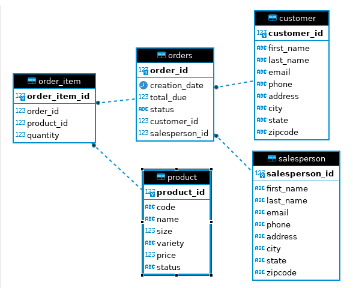

# Introduction
This application uses JDBC to perform operations on a PostgreSQL database, using Maven to 
provide the Postgres JDBC driver. The JDBCExecutor class contains code for CRUD operations on
customer entities. SQL scripts were also used to set up the database, which is hosted in a Docker 
instance. The ERD was created using DBeaver Community Edition.

# Implementation
## ER Diagram


## Design Patterns
Data Access Objects (DAO) and Repository patterns are two options used to help JDBC with accessing
databases. This project uses the DAO pattern.

### DAO
DAOs are used to provide abstraction between JDBC and the rest of the code. DAOs for specific domain
models (e.g. UserDAO for User domain) generally implement a common interface, and the associated
methods are used by the application to access and modify the database. By acting as an intermediary 
between the two layers, DAOs hides the complexity of performing CRUD operations from the application
layer.

### Repository
Repositories provide an abstraction of a collection of objects, handling only a specific type of
data. In comparison to DAOs, repositories are closer to the domain than the database. Repositories 
also focus on single-table access, whereas DAOs can access single or multiple tables; you can 
implement a repository using a DAO, but the opposite is not true. 


# Test
Testing the app was done by running operations against a Postgres database. 
Pull the Postgres docker image, and set up the database using the [psql_docker](https://github.com/jarviscanada/jarvis_data_eng_MaximilianHuang/blob/develop/linux_sql/scripts/psql_docker.sh)
script:
```
docker pull postgres
psql_docker.sh create db_username db_password
psql_docker.sh start
```
Replace `db_username` and `db_password` with the credentials to be used for the psql instance.
Run the SQL scripts to set up the tables:
```
psql -h localhost -U db_username -f database.sql
psql -h localhost -U db_username -d hplussport -f customer.sql
psql -h localhost -U db_username -d hplussport -f product.sql
psql -h localhost -U db_username -d hplussport -f salesperson.sql
psql -h localhost -U db_username -d hplussport -f orders.sql
```
Each time you will be prompted to enter `db_password`. JDBCExecutor can now be run to test the CRUD
operations on the customer database; all four are in the file, but only deletion is commented out.
Uncomment the operation to test, changing any fields as necessary. Afterwards, the results can be
checked from the database:
```
psql -h localhost -U postgres -d hplussport
SELECT * FROM customer WHERE ...
```