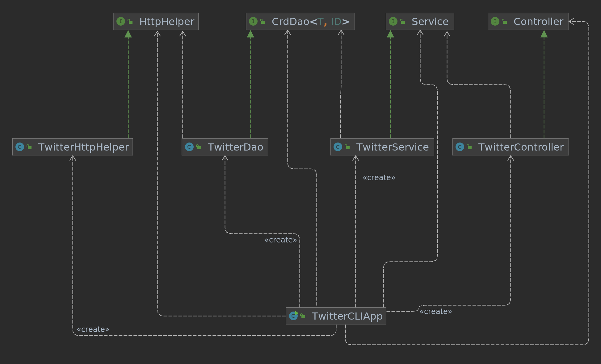

# Introduction
This project is a CLI application that can be used to post, view, and delete Twitter posts, using the Twitter REST API. Users allow access to their Twitter accounts by providing their API credentials as command line arguments to the program. The technologies used include the Twitter v1.1 API, SpringBoot, Maven, Docker, Jackson for JSON processing, and Mockito for testing.

# Quick Start
To compile, and package the app using Maven, first download the repository then run from this directory (```core_java/twitter```):
```
mvn clean package
```
Afterwards, the compiled JAR can be packaged and ran using a Docker image and instance. Replace ```name``` with the name of your choice.
```
docker_name=name
docker build -t ${docker_name}/twitter .
```
The app can also be simply run by pulling from Docker Hub. Replace ```huangm66``` with the name from the previous step if desired, and all the exported variables with appropriate Twitter API credentials.
```
docker run --rm \
-e consumerKey=YOUR_VALUE \
-e consumerSecret=YOUR_VALUE \
-e accessToken=YOUR_VALUE \
-e tokenSecret=YOUR_VALUE \
jrvs/twitter_app post "test post" "43:79"
```


# Design
## UML diagram


- The TwitterCLIApp class is the main class used to run the application, declaring and instantiating all components. It handles parsing the command line arguments and environment variables and then makes the appropriate method calls to the TwitterController.
- The TwitterController is used to translate user input into the corresponding calls to the service layer, making method calls to the TwitterService class. The controller only checks that the user provided arguments are formatted correctly, raising an exception if the arguments are in an invalid format, or there is an incorrect number of arguments.
- TwitterService handles the business logic of the application; when posting a tweet, TwitterService checks that the text of the tweet isn't too long, and that the longitude/latitude are in a valid range. When deleting or viewing tweets, it checks that the provided ID is a number. It calls the TwitterDAO.
- The TwitterDAO (data access object) is the class responsible for accessing data from a remote source. In this case, the DAO makes calls to the Twitter REST API to create, read, and delete tweets. It creates URIs for HTTP requests, using them for calls to the TwitterHTTPHelper.
- The TwitterHTTPHelper is a helper class for the TwitterDAO. It is given the API credentials specified by the user (from command line arguments) and then creates and executes an HTTP request for the specified CRUD operation.

## Models
In order to process the Tweets returned from the Twitter API (returned as JSON) into a format usable by Java, the Jackson library is used to create POJOs (plain old Java objects). These objects are described by the 5 classes in the ```twitter.model``` package, and they are based on the object specifications given in the Twitter API documentation. Note that for simplicity, some attributes were omitted from the Java classes. The following tables show the properties of each object, and what types they are as Java objects.

### Tweet
| Attribute      | Type               | Description                                                             |
|----------------|--------------------|-------------------------------------------------------------------------|
| created_at     | String             | UTC time when Tweet was created                                         |
| id             | long               | Integer representation of unique identifier of Tweet                    |
| id_str         | String             | String representation of unique identifier                              |
| coordinates    | Coordinates object | Object that stores the geographic location of the Tweet                 |
| retweet_count  | int                | Number of times Tweet has been retweeted                                |
| favorite_count | int                | Number of times Tweet has been liked                                    |
| entities       | Entities object    | Object representing the entities that have been parsed out of the Tweet |
| favorited      | boolean            | If the Tweet has been liked by the user authenticating the request      |
| retweeted      | boolean            | If the Tweet has been retweeted by the authenticating user              |

### Coordinates
| Attribute      | Type           | Description                                                             |
|----------------|----------------|-------------------------------------------------------------------------|
| coordinates    | List of Double | List of 2 doubles, representing longitude and latitude respectively     |
| type           | String         | Type of data in coordinates property; for Tweet, will always be "Point" |

### Entities
| Attribute      | Type                        | Description                                                             |
|----------------|-----------------------------|-------------------------------------------------------------------------|
| hashtags       | List of Hashtag objects     | Represents hashtags parsed from the Tweet text                          |
| user_mentions  | List of UserMention objects | Represents other users mentioned in the Tweet text                      |

### Hashtags
| Attribute      | Type         | Description                                                                                 |
|----------------|--------------|---------------------------------------------------------------------------------------------|
| indices        | Array of int | Array of 2 integers specifying the location of the start and end of the text of the hashtag |
| text           | String       | Name of hashtag, not including the hashtag (#) character                                    |

### User mentions
| Attribute      | Type         | Description                                                             |
|----------------|--------------|-------------------------------------------------------------------------|
| id             | long         | Unique identifying integer of mentioned user                            |
| id_str         | String       | String representation of ID of mentioned user                           |
| indices        | Array of int | String representation of unique identifier                              |
| name           | String       | Object that stores the geographic location of the Tweet                 |
| screen_name    | String       | Number of times Tweet has been retweeted                                |


## Spring
Dependency management was done using Spring Boot for dependency injection. The Bean approach was implemented but is not currently used; instead the project uses ComponentScan for dependency management. The TwitterCLIComponentScan class is used to tell the IoC container which packages to scan. 

# Test
The app was tested using JUnit 4 and Mockito for the Twitter HttpHelper, DAO, Service, and Controller classes. There were two types of tests for each class: integration testing, to check that the dependencies of the tested class work properly in combination, and unit testing, to check that the functionality of only the tested class works properly. 

Unit tests were created using Mockito, which allowed tests to mock the behavior of dependencies required for the tested class to function. This allows for testing functionality like checking the validity of arguments without having to worry about whether the dependencies work correctly. 


## Deployment
As mentioned above, the application was compiled using Maven, and packaged using Docker. Afterwards, the image was pushed to Docker Hub, from which it is deployed.

# Improvements
- Implement show tweet optional feature (print only selected fields)
- Clean up/reformat output (showing HTTP request output is messy and can be insecure)
- Add clean up functionality to integration tests (Tweets are spam created and not deleted)