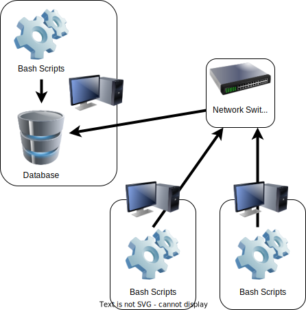

# Linux Cluster Monitoring Agent
## Introduction
This project contains a set of Bash and SQL scripts used to record the hardware specifications and resource usage of a cluster of Linux servers. One system is required to install and host a PostgreSQL database, which stores information submitted from other systems. Resource usage information can be manually gathered, or can be automated as a cron job.
The technologies used are Bash, Docker, PostgreSQL, Git, and Crontab.

## Quick Start
First, ensure that Docker is installed on the system. Use `psql_docker.sh` to create and start a Docker container. This container will host the PostgreSQL instance storing system and usage information:
```
./scripts/psql_docker.sh create db_usename db_password
./scripts/psql_docker.sh start
```
Note that db_username and db_password are used to set the superuser and superuser password for the PostgreSQL instance, respectively.

Next, create the database that will be used. Note that the hostname will be `localhost` when the command is run on the same machine hosting the Docker container:
```
psql -h hostname -U db_username -W
CREATE DATABASE host_agent;
```

Now the tables for storing system information and system usage can be added:
```
psql -h hostname -U db_username ./sql/ddl.sql 
```

Before a computer can submit usage information, details about the system itself must be stored. This can be done by running `host_info.sh`:
```
./scripts/host_info.sh hostname port db_name username password
```

Now, information about system usage can be inserted into the database using `host_usage.sh`:
```
./scripts/host_usage.sh hostname port db_name username password
```

This script can be automated using `crontab`. Open the list of crontab jobs using:
```
crontab -e
```
Add the following line to the opened file. Make sure to replace each argument appropriately, using an absolute path to the script:
```
* * * * * bash .../path_to/host_usage.sh hostname port host_agent username password >> /tmp/host_usage.log
```
This will cause `host_usage.sh` to run every minute, with the output stored in `/tmp/host_usage.log`...

## Implementation
The project was implemented using Bash scripts to handle the creation and usage of the PSQL Docker container, and to insert hardware details and resource usage to the database. Additionally, an SQL script is used to initialize the databases used to store information inside the PSQL instance.

## Architecture
Below is a diagram representing a cluster of nodes using the monitoring agent. Multiple systems connected on a network are able to submit information to a single system hosting the PSQL database.

 

## Scripts
Shell scripts and usage:

### psql_docker.sh
Used to create and start/stop the Docker container running the PostgreSQL instance. 

Usage:
```     
psql_docker.sh create db_username db_password 
psql_docker.sh start 
psql_docker.sh stop 
```

### host_info.sh
Used to insert the hardware specifications of the current system to the PSQL database. 
Must be run on a system before it can run ```host_usage.sh```.

Usage:
```     
host_info.sh hostname port db_name username password
```

### host_usage.sh
Used to insert the resource usage of the current system to the PSQL database. 

Usage:
```     
host_usage.sh hostname port db_name username password
```

### crontab
Used to schedule executions of ```host_usage.sh```, to automate collection of usage data.

Usage:
```
cron -e
* * * * * bash .../path_to/host_usage.sh hostname port host_agent username password >> /tmp/host_usage.log
```
Modify the line written to the file as required to change interval at which script is run.

## Database Modelling
Host Info

| Column           | Description                         | Type      | Constraints |
|------------------|-------------------------------------|-----------|-------------|
| id               | Serial identifying number of system | serial    | Primary key |
| hostname         | FQDN of the system                  | varchar   | Unique      |
| cpu_number       | Logical CPU number                  | integer   | Not null    |
| cpu_architecture | CPU architecture type               | varchar   | Not null    |
| cpu_model        | CPU model name                      | varchar   | Not null    |
| cpu_mhz          | CPU frequency in MHz                | double    | Not null    |
| l2_cache         | L2 cache size (KB)                  | integer   | Not null    |
| total_mem        | Total memory in system              | integer   | Not null    |
| timestamp        | When host info was collected        | timestamp | Not null    |

Host Usage

| Column         | Description                   | Type      | Constraints                 |
|----------------|-------------------------------|-----------|-----------------------------|
| timestamp      | When usage data was collected | timestamp | Not null                    |
| host_id        | Id number of host system      | serial    | Foreign key (references id) |
| memory_free    | FQDN of the system            | varchar   | Unique                      |
| cpu_idle       | Logical CPU number            | integer   | Not null                    |
| cpu_kernel     | CPU architecture type         | varchar   | Not null                    |
| disk_io        | CPU model name                | varchar   | Not null                    |
| disk_available | CPU frequency in MHz          | double    | Not null                    |

## Test
Testing of the Bash scripts, SQL queries, and cron job was done on a virtual machine running CentOS 7, using the
CLI from the Linux terminal and IntelliJ IDEA terminal. 

## Deployment
The app was deployed using GitHub for storage and distribution, Docker to run the PSQL instance, and Crontab to automate `host_usage.sh`.

## Improvements
<ul>
    <li>
        Automate creation of <code>host_agent</code> database in a shell script
    </li>
    <li>
        Implement SQL extra ticket
    </li>
    <li>
        Automate crontab job creation in a shell script
    </li>
</ul>